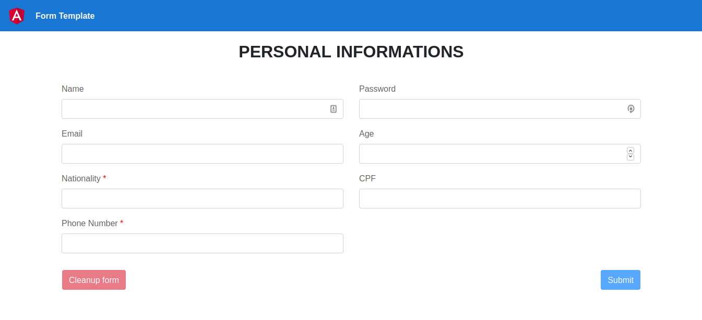

# Angular form schematic

This repository is a basic Schematic implementation to generate Angular Forms using a JSON description

## Getting started

To test this schematic you must follow the steps:

1. Install dependencies on form generator folder

```
cd form-generator
npm install
npm run build
```

2. Install dependencies on project example to test the generator

```
cd example/angular-template
npm install
```

3. Inside the angular-template folder type:

```
npm link ../../
npm start
```

Now you can proccede creating forms component and testing the generator.

PS: Inside angular-template/jsons folder has some form schemas example to be used.

## Form Generator

This schematic is responsible for generate a form schematic using a pass by JSON, using bootstrap!

```
ng g form path/name-component ./jsons/schema.json
```

or

```
ng g f path/name-component ./jsons/schema.json
```

Options Available:

| Option                    | Type    | Description                                                           | Enums               | Default |
| ------------------------- | ------- | --------------------------------------------------------------------- | ------------------- | ------- |
| --name, first argv        | string  | Custom component name. What name would you like to use for the forms? |                     |         |
| --config, -c, second argv | string  | Config file to the forms. What the name of the config file?           |                     |         |
| --style                   | string  | The file extension to be used for style files.                        |                     | scss    |
| --viewEncapsulation, -v   | string  | Specifies the view encapsulation strategy.                            | "Emulated", "None"  |         |
| --prefix, -p              | string  | The prefix to apply to generated selectors.                           |                     | app     |
| --changeDetection, -cd    | string  | Specifies the change detection strategy.                              | "Default", "OnPush" | Default |
| --export, -e              | boolean | Specifies if declaring module exports the component.                  |                     | false   |
| --entryComponent          | boolean | Specifies if the component is an entry component of declaring module. |                     | false   |

## How to configure this schematic in another project

1. First you should install dependencies and build the schematic form lib

```
cd form-generator
npm install
npm run build
```

2. You should install the schematic in your project

```
npm link ../path-forms/forms-generator
```

Inside your angular json in "cli" key you should add:

```
"defaultCollection": "forms"
```

will stay:

```
"cli": {
    "analytics": false,
    "defaultCollection": "forms"
}
```

## Necessary imports

```
    ReactiveFormsModule,
    FormsModule,
    NgxMaskModule.forRoot({
        validation: true
    })
```

## Output Example



## Backlog

-   [x] Support input elements
-   [x] Support input types
-   [x] Masks using ngx-masks (zipCode, cpf, phoneNumber, etc)
-   [x] Created formBuilder
-   [x] Required validation
-   [x] Submit and reset actions
-   [x] Pattern, maxlength, minlength, min and max validations
-   [x] Showing label
-   [x] Created interface from formBuilder value
-   [x] Update module declarations and add ReactiveFormsModule and FormsModule
-   [ ] Add to npm
-   [ ] Support multiple UI frameworks - Bootstrap, Material UI, etc
-   [ ] Option to disable app-section
-   [ ] Schematic to add app-section
-   [ ] Option to disable app-custom-input
-   [ ] Schematic to add app-custom-input
-   [ ] Support others HTML elements: text-area, select, multi-select, checkbox and date picker
-   [ ] Generate specs file with tests suite
-   [ ] Support Karma/Jasmine and Jest
-   [ ] Add E2E with Cypress
-   [ ] Support to form array
-   [ ] Support nested form-group inside form builder
-   [ ] Add dynamic forms using FormArray
-   [ ] Create others template with others UI framework to test the generator
-   [ ] Support translation and add keys on json form to each field
-   [ ] Add confirmation modal before reset form
-   [ ] Passing CSS class on json schema to control form-control styles
-   [ ] Placeholder
-   [ ] Tooltip information on inputs
-   [ ] Show error messages
-   [ ] Fields disable and readonly
-   [ ] Field with a default value (json form)
-   [ ] Fill dropdown with options - passing endpoint or array with options
-   [ ] Add more validations to invalid fields inside the JSON schema

## Testing

To test locally, install `@angular-devkit/schematics-cli` globally and use the `schematics` command line tool. That tool acts the same as the `generate` command of the Angular CLI, but also has a debug mode.

Check the documentation with

```bash
schematics --help
```

## Unit Testing

`npm run test` will run the unit tests, using Jasmine as a runner and test framework.

## Publishing

To publish, simply do:

```bash
npm run build
npm publish
```

That's it!

## Contribute

Pickup an item on backlog, create an issue and submit the PR.

## Licence

MIT licence, check [LICENSE.md](LICENSE.md)
